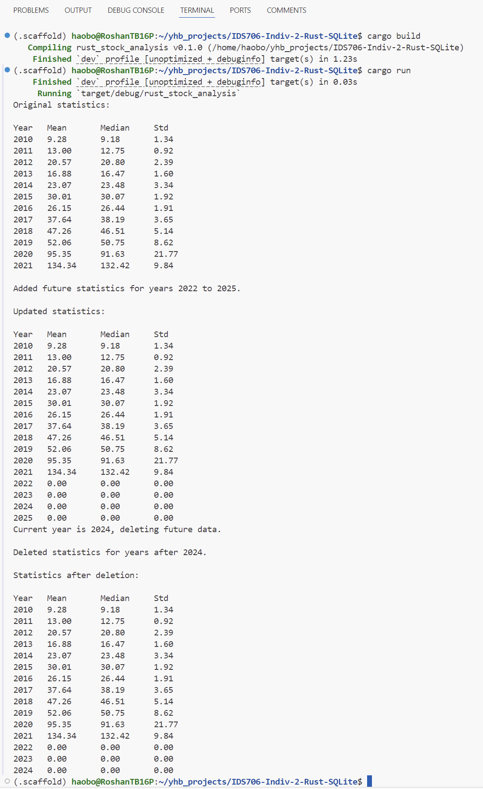

# IDS-706 Data Engineering: Individual Project 2

This is the Individual Project 2 for IDS-706, focused on Rust CLI Binary with SQLite.

In this project, following tasks are completed:
- Rust source code: The code should comprehensively understand Rust's syntax and unique features.
- Use of Github Copilot (Use of other LLMs): In your README, explain how you utilized Github Copilot or other LLM models in your coding process.
- SQLite Database: Include a SQLite database and demonstrate CRUD (Create, Read, Update, Delete) operations.
- Optimized Rust Binary: Include a process that generates an optimized Rust binary as a Gitlab Actions artifact that can be downloaded.
- README.md: A file that clearly explains what the project does, its dependencies, how to run the program, and how Gitlab Copilot was used.
- Github/Gitlab Actions: A workflow file that tests, builds, and lints your Rust code.
- Video Demo: A YouTube link in README.md showing a clear, concise walkthrough and demonstration of your CLI binary.


## Run Result



## Project Details

The project relies on the following dependencies:

- Rust and Cargo: Programming language and package manager.
- rusqlite = "^0.29": SQLite bindings for Rust, allowing interaction with SQLite databases.
- csv = "^1.0": For reading and writing CSV files.
- serde = { version = "1.0", features = ["derive"] }: Framework for serializing and deserializing Rust data structures efficiently and generically.
- serde_derive = "1.0": Provides macros to automatically generate implementations for Rust data structures.
- libsqlite3-dev: SQLite development library required for rusqlite.

### Data Processing


The statistical results are based on close price of <NASDAQ 100 Data From 2010> dataset on Kaggle.
>https://www.kaggle.com/datasets/kalilurrahman/nasdaq100-stock-price-data/data 

The csv file <stock_AAPL.csv> is generated by the same script from [Week 3 mini-project lib.py](https://github.com/haobo-yuan/IDS706-3-Polars-Stat/blob/main/lib.py) with some minor edits. These scripts are also stored in `/src` folder of this project for convenient reference.

### Instructions to Run the Project

1. Clone the repository to your local machine.
2. Navigate to the project directory.
3. Install Rust and Cargo if you haven't already.
4. Install the required dependencies
    ```bash
    sudo apt-get update
    sudo apt-get install libsqlite3-dev
    ```
5. Run the project using the following command:
    ```bash
    cargo build
    cargo run
    ```

### CI/CD Pipeline (Github Actions)

These steps are used in `Makefile` and `main.yml` to set up the CI/CD pipeline for the project:

- Format code
- Lint code
- Test coce


### Video Demo

[](https://youtu.be/NOLGiHmgOyE)

### How ChatGPT and Github Copilot were used in the project

In this project, ChatGPT was used to generate and optimize code, providing solutions and recommendations to speed up the development process. 
ChatGPT was also used to generate the README file and provide suggestions for improving the project's documentation.
GitHub Copilot assists in coding, providing intelligent code completion and snippet suggestions to improve coding efficiency.

### Function Overview
Below is a list of functions and their purposes in the project:

- **init_db(db_path: &str) -> Result<Connection>**

  Initializes the SQLite database at the specified path. It creates the `stock_data` table if it doesn't exist.

- **load_csv_to_db(conn: &Connection, csv_path: &str) -> Result<(), Box<dyn Error>>**

  Loads stock data from a CSV file and inserts the records into the `stock_data` table in the database.

- **calculate_stats(conn: &Connection) -> Result<Vec<(i32, f64, f64, f64)>, Box<dyn Error>>**

  Calculates the mean, median, and standard deviation of closing prices grouped by year.

- **save_stats_to_db(db_path: &str, stats: &Vec<(i32, f64, f64, f64)>) -> Result<(), Box<dyn Error>>**

  Saves the calculated statistics to a new SQLite database at the specified path. It creates the `stats_data` table if it doesn't exist.

- **add_future_stats(conn: &Connection) -> Result<(), Box<dyn Error>>**

  Adds placeholder statistics for future years (2022 to 2025) into the `stats_data` table.

- **display_stats(conn: &Connection) -> Result<(), Box<dyn Error>>**

  Retrieves and displays the statistics from the `stats_data` table, ordered by year.

- **delete_future_stats(conn: &Connection) -> Result<(), Box<dyn Error>>**

  Deletes statistics for years after the current year (2024) from the `stats_data` table.

---

## AAPL Price Statistics (2010-2021)

The final statistics are as follows:
| Year | Mean   | Median | Std  |
|------|--------|--------|------|
| 2010 | 9.28   | 9.18   | 1.34 |
| 2011 | 13.00  | 12.75  | 0.92 |
| 2012 | 20.57  | 20.80  | 2.39 |
| 2013 | 16.88  | 16.47  | 1.60 |
| 2014 | 23.07  | 23.48  | 3.34 |
| 2015 | 30.01  | 30.07  | 1.92 |
| 2016 | 26.15  | 26.44  | 1.91 |
| 2017 | 37.64  | 38.19  | 3.65 |
| 2018 | 47.26  | 46.51  | 5.14 |
| 2019 | 52.06  | 50.75  | 8.62 |
| 2020 | 95.35  | 91.63  | 21.77 |
| 2021 | 134.34 | 132.42 | 9.84 |

A plot of the mean close price for each year generated from previous project is shown below:


## Description and Conclusion:
Apple Inc.'s stock performance from 2010 to 2021 shows significant growth, with the average
price rising from $9.28 to $134.34. The company saw consistent increases in stock value, 
particularly in 2020 and 2021, likely driven by strong demand for electronics during the pandemic
and its market leadership in innovation. While volatility increased in the later years, especially
in 2020 with the standard deviation peaking at 21.81, Apple's overall performance was robust,
reflecting its resilience and growth in the global tech industry.
